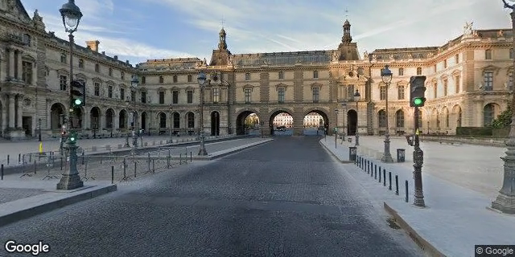
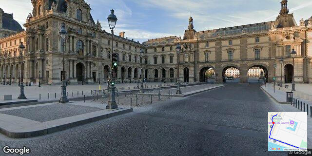

# Getting started with `svmm`

This covers getting Google API credentials, storing them safely, running the CLI, and understanding what a run costs before you commit to it.

## 1. Get Google API credentials

The CLI calls three Google Maps Platform APIs directly, and relies on a fourth indirectly:

- **Directions API** — turns `--from`/`--to` into a route.
- **Street View Static API** — downloads the actual frames.
- **Maps Static API** — fetches the one inset route-map image shown in a frame corner by default (see [Inset route map](#inset-route-map---hide-map--map-corner--map-size) below); skip enabling it if you always pass `--hide-map`.
- **Geocoding API** (indirect) — when `--from`/`--to` is a place name rather than `"lat,lon"`, the Directions API resolves it internally using Geocoding. You don't call it yourself, but it must be enabled on your project or place-name resolution fails.

Setup:

1. Go to the [Google Cloud Console](https://console.cloud.google.com/) and create or select a project.
2. In **APIs & Services → Library**, enable **Directions API**, **Street View Static API**, **Maps Static API**, and **Geocoding API**.
3. **Enable billing** on the project — Street View Static API requires it even though usage is often free at low volume (see [Cost](#4-cost) below).
4. In **APIs & Services → Credentials**, create an API key. One key works across all three APIs. Optionally restrict it (API restrictions to just those three, and/or application restrictions) since it'll sit in your local secrets store.
5. Official docs, if you want the detail: [Street View API key setup](https://developers.google.com/maps/documentation/streetview/get-api-key), [Directions API key setup](https://developers.google.com/maps/documentation/directions/get-api-key).

### Adding a new Google API to an existing key later

A future feature may need another Google Maps Platform API added to a key you already have (this happened when the inset-map feature above added a dependency on Maps Static API). Two separate gates have to pass, and it's easy to fix only one of them:

1. **Find which project your key belongs to.** Go to [console.cloud.google.com/apis/credentials](https://console.cloud.google.com/apis/credentials). The project picker dropdown at the top of the page shows the currently-selected project — a key only shows up on this page while that key's project is selected, so you may need to switch projects (via that same dropdown) to find it. To confirm you've found the right key, reveal its value locally with `fnox get <KEY_NAME>` and compare against "Show key" next to each entry on this page.
2. **Enable the API on that project.** With the right project still selected, go to [console.cloud.google.com/apis/library](https://console.cloud.google.com/apis/library), search for the API by name, and click it. A blue **ENABLE** button means it isn't enabled yet — click it. A greyed-out **MANAGE** button means it already is.
3. **Check the key's own API restrictions.** Back on the Credentials page, click the key's name (not the eye icon) to open its settings. Under **"API restrictions"**: if it says "Don't restrict key", skip this step. If it says "Restrict key" with a checklist below, the new API needs its checkbox ticked too — a key can be scoped to only the APIs it originally needed, and enabling an API on the project does **not** update that list automatically. Tick it and click **Save**.

Both gates apply independently: an API enabled on the project but not checked in the key's restriction list still fails, and vice versa.

## 2. Store the keys with fnox

Don't put real keys in a plaintext `.env`. This repo's `fnox.toml` is configured with an `age` encryption provider, so only ciphertext ever gets committed:

```sh
# one-time: generate your local age key if you don't already have one
mkdir -p ~/.config/fnox && age-keygen -o ~/.config/fnox/age.txt

# store both keys (prompts interactively — never on the command line)
fnox set STREETVIEW_API_KEY --provider age
fnox set DIRECTIONS_API_KEY --provider age
```

Run the CLI with `fnox exec -- ...` so the keys are loaded as env vars for that command only, or `eval "$(fnox activate bash)"` (or `zsh`/`fish`) to auto-load them whenever you `cd` into this repo.

## 3. Run it

```sh
fnox exec -- cargo run --release -- --from "Marseille Provence Airport" --to "Simiane-la-Rotonde"
```

`--from`/`--to` accept `"lat,lon"` or a free-text place name — both go through the same resolution path. Run `cargo run -- --help` for the full flag list. One gotcha: pass negative numeric values with `=`, e.g. `--pitch=-30`, not `--pitch -30` — a bare `-30` after a space is read as an unrecognized flag, not this flag's value.

Every run prints the resolved route, the number of images it will download, and an estimated cost, then stops for confirmation (or exits immediately with `--dry-run`) before anything is downloaded. Nothing is downloaded without that gate unless you pass `--yes`.

`--output` (the filestem for the video and preview image, and the default output directory name) is optional — pass it to name a run yourself, or omit it and the CLI computes `<from>-<to>-<datetime>` from the values you gave `--from`/`--to` and the current local time (e.g. `48-8611-2-3358-simiane-la-rotonde-20260824T090043`).

### What to expect

Here's a single frame from a real run over a short, cheap demo route (Rue de Rivoli, by the Louvre), which resolved the route, downloaded 342 Street View frames along it, and encoded them into a video:



Alongside the video, every run also saves one representative still (the middle frame of the final output) as a preview image next to it — same filestem, `.jpg` extension — so you can glance at the result without opening the video.

Reproduce it with `mise run demo`, or directly:

```sh
fnox exec -- cargo run --release -- --from "48.8611,2.3358" --to "48.8592,2.3376" --output demo --hop-size 500 --yes
```

A re-run resumes from `./output/demo` rather than re-downloading, so it's safe to run again after the first time.

### Prefer prompts to flags? Use `--interactive`

Don't want to memorise flag names, or unsure what `--fov`, `--radius`, or `--hop-size` should be? Pass `-i`/`--interactive` and the CLI asks for each value in turn, showing its default in brackets — press enter to accept it, or type a value to override:

```sh
fnox exec -- cargo run --release -- --interactive
```

`--interactive` fills in only what's missing. Combine it with any flags you already know:

```sh
fnox exec -- cargo run --release -- --interactive --from "Marseille Provence Airport" --to "Simiane-la-Rotonde"
```

Here `--from`/`--to` are used as given, and you're only prompted for `--output` (showing the computed `<from>-<to>-<datetime>` default, editable or acceptable as-is) and the remaining tuning flags. Without `--interactive`, `--from`/`--to` left unset cause the CLI to error out and suggest `--interactive` instead of guessing a value for you; `--output` is optional either way (see [Run it](#3-run-it) above).

### Steering the route: `--avoid-tolls`/`--avoid-highways`/`--avoid-ferries`

These mirror Google Maps' own "Avoid tolls/highways/ferries" toggles: pass any combination to steer the one route the Directions API returns away from that feature. All three default to off (avoid nothing), matching Maps' own default:

```sh
fnox exec -- cargo run --release -- --from "Marseille Provence Airport" --to "Simiane-la-Rotonde" --output my_trip --avoid-tolls --avoid-highways
```

Under `--interactive`, you're prompted for each (y/N) alongside the other tuning values.

### Inset route map: `--hide-map`/`--map-corner`/`--map-size`

Every run composites a small inset map into a frame corner, centered on your current position and rotated so your direction of travel always points to the top ("track-up", like a car GPS display, not fixed north-up). It's on by default:

```sh
fnox exec -- cargo run --release -- --from "Marseille Provence Airport" --to "Simiane-la-Rotonde" --map-corner top-left
```

- `--hide-map` turns it off entirely (no Maps Static API call, no cost line, no `composited/` output directory — the video is built straight from the downloaded frames).
- `--map-corner` picks which corner it sits in: `top-left`, `top-right`, `bottom-left`, or `bottom-right` (default).
- `--map-size` (default `200x200`) sets the size of the local-area window panned around your position, not the on-frame footprint (a fixed percentage of the frame's shorter dimension, so it stays proportionally consistent across different `--picsize` aspect ratios) and not the raw Maps Static request size (see below).

Only one Maps Static API call happens per run, regardless of frame count: the CLI always fetches one larger base map (640x640, the API's free-tier maximum) covering the whole route, cached at `<output-dir>/map.png`. Per frame, it draws the marker on that base image at its true position, crops a window around the marker large enough to rotate without exposing empty corners, rotates that so the current heading points up, then crops the final `--map-size` window from its center and pastes that into the corner — so the inset stays centered on you and oriented to your direction of travel, panning/rotating across the one cached image, with no extra API calls. If the project behind `DIRECTIONS_API_KEY` doesn't have the Maps Static API enabled, the run doesn't fail — it prints a one-time message and finishes the video without the inset instead.

Here's a frame from the same demo route as above, with the inset showing a marker centered in a zoomed-in, track-up local view around the current position:



## 4. Cost

Prices below are from Google's published rate card (developers.google.com/maps/billing-and-pricing/pricing, checked 2026-08-23) — verify against the live console before relying on them at volume, since Google's pricing changes.

| API call | Price | Monthly free allowance |
| --- | --- | --- |
| Street View **metadata** probe (checking if a panorama exists at a point) | Free, unlimited | n/a |
| Street View **Static** image (the actual downloaded frame) | $7.00 / 1,000 | First 10,000 |
| Directions (one call per run) | $5.00 / 1,000 | First 10,000 |
| Maps Static (one call per run, for the inset map — skipped entirely with `--hide-map`) | $2.00 / 1,000 | First 10,000 |

The CLI can't see how much of your monthly free allowance you've already used, so the cost line it prints is a **worst-case estimate assuming none remains** — the real charge may be $0. Use `--dry-run` to see the resolved route, image count, and cost estimate without downloading anything (note: the one Directions call still happens and is billed, negligibly, under `--dry-run` too).

### Image count doesn't shrink much with `--hop-size`

For a real, non-trivial route (tens of km), you might expect a larger `--hop-size` (the spacing between sampled points, default 10m) to proportionally cut the image count. In practice it doesn't, much: image count is mostly set by how many distinct Street View panoramas actually exist along the route (typically one every 10-20m on covered roads), and `--hop-size` just needs to be small enough not to skip past panoramas — increasing it well beyond that spacing eventually reduces count, but not until it's much larger than the natural panorama density.

Example measured on a real ~90km airport-to-village route:

| `--hop-size` | `--turn-threshold` | Images |
| --- | --- | --- |
| 50 (default 10) | default (5) | 9,198 |
| 100 | 20 | 7,831 |
| 200 | default | 8,641 |
| 1000 | default | 8,507 |

`--turn-threshold` (how much a heading has to change before extra turn frames get inserted) has more effect than `--hop-size` on a winding road, but even a generous threshold only trims the count by 10-20% here — most of it is genuine panorama density, not an artifact of the tuning flags. If you want a meaningfully shorter/cheaper video for a long route, `--hop-size` in the many-hundreds-of-meters range is the main lever available today; there's no built-in "keep every Nth frame" downsampling yet.

## 5. Resuming and starting over

Re-running the same `--output` name resumes from persisted state (`<output-dir>/itinerary.json`) rather than re-probing and re-downloading everything — useful if a run gets interrupted. If you change `--from`/`--to` or the tuning flags for the same `--output` name, the CLI detects the mismatch and refuses to resume (to avoid silently mixing two different routes); pass `--fresh` to start over deliberately.

## 6. Releasing

### If you downloaded a prebuilt binary

Binaries on the [Releases page](https://github.com/thoroc/street-view-movie-maker/releases) are
built by CI from the exact tagged source — nothing hand-assembled. Two things they don't include:

- **`ffmpeg` is not bundled.** `svmm` shells out to `ffmpeg` on `PATH` at runtime; install it
  yourself (the `mise install` path above does this for you automatically, but a downloaded
  binary doesn't go through that).
- **The binaries are unsigned.** macOS Gatekeeper and Windows SmartScreen will warn on first run;
  there's no code-signing/notarization pipeline for this project.

### If you're maintaining this repo

Versioning and the changelog are automated by [`release-plz`](https://release-plz.dev/), not
edited by hand:

1. Conventional Commits pushed to `main` accumulate in a standing "release PR" that
   `release-plz` opens and keeps up to date — its diff is the version bump plus the
   `CHANGELOG.md` entry. Review and merge it like any other PR; nothing else is manual.
2. Merging it is itself a push to `main`, which is what `release-plz` uses to notice the new,
   as-yet-untagged version and create the git tag.
3. That tag push triggers `.github/workflows/release.yml`, which cross-compiles for macOS
   (arm64 + x86_64), Linux (x86_64), and Windows (x86_64) and publishes the binaries to a
   GitHub Release with the `CHANGELOG.md` entry as its notes.

`release-plz.yml` opens its PR using the repo secret `RELEASE_PLZ_TOKEN` (falling back to the
default `GITHUB_TOKEN` if absent) so that `ci.yml` actually runs on the release PR before merge —
GitHub does not trigger `pull_request`-event workflows on a PR authored by the default bot
identity. To (re)create that secret:

1. Create a fine-grained PAT at <https://github.com/settings/personal-access-tokens/new>, scoped
   to only this repository, with **Contents: Read and write** and **Pull requests: Read and
   write** permissions.
2. `gh secret set RELEASE_PLZ_TOKEN --repo thoroc/street-view-movie-maker` from a terminal
   authenticated as you, and paste the token when prompted (avoids it ever landing in shell
   history).

See `docs/ADR/adr-011-release-plz-plus-hand-authored-release-workflow.md` for why this shape was
chosen over alternatives.
